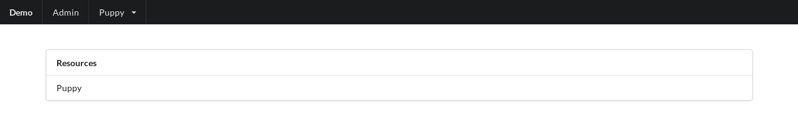
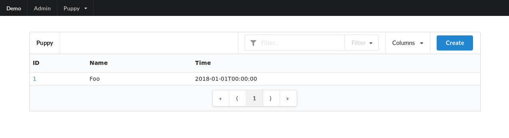
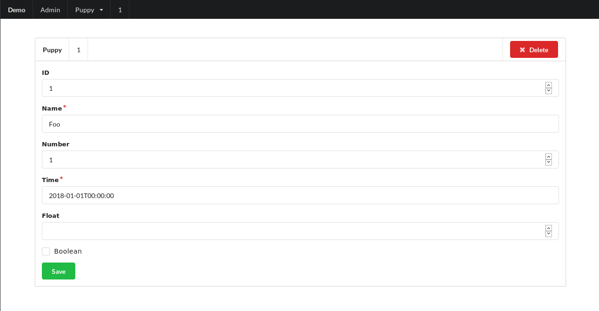

# API Star CRUD
[](https://travis-ci.org/PeRDy/apistar-crud)
[](https://codecov.io/gh/PeRDy/apistar-crud)
[](https://badge.fury.io/py/apistar-crud)

* **Version:** 0.6.3
* **Status:** Production/Stable
* **Author:** José Antonio Perdiguero López

## Table of Contents

- [API Star CRUD](#api-star-crud)
  * [Features](#features)
    + [Resource](#resource)
    + [ORM](#orm)
    + [Admin site](#admin-site)
  * [Quick start](#quick-start)
  * [Usage](#usage)
    + [SQLAlchemy](#sqlalchemy)
    + [Peewee](#peewee)
  * [Resources](#resources)
    + [Routes](#routes)
    + [Override methods](#override-methods)
    + [Filtering](#filtering)
  * [Admin](#admin)
    + [Main page](#main-page)
    + [Resource list](#resource-list)
    + [Resource detail](#resource-detail)

## Features
API Star CRUD provides an easy way to define a REST resource and generic operations over it.

### Resource
The resources are classes with a default implementation for **methods**:
* `create`: Create a new element for this resource.
* `retrieve`: Retrieve an element of this resource.
* `update`: Update (partially or fully) an element of this resource.
* `delete`: Delete an element of this resource.
* `list`: List resource collection with **filtering** capabilities.
* `drop`: Drop resource collection.

### ORM
API Star CRUD supports the following ORM:
* [SQLAlchemy](https://www.sqlalchemy.org/) through [apistar-sqlalchemy](https://github.com/PeRDy/apistar-sqlalchemy).
* [Peewee](https://github.com/coleifer/peewee) through [apistar-peewee-orm](https://github.com/PeRDy/apistar-peewee-orm).

### Admin site
API Star CRUD serves an admin site to handle resources in a graphical way, by default this site is routed to `/admin`. 

## Quick start
Install API Star CRUD:

```bash
$ pip install apistar-crud[peewee]
```

or 

```
$ pip install apistar-crud[sqlalchemy]
```

Follow the steps:

1. Create an **input type** and **output type** for your resource:
2. Define a **model** based on your ORM.
3. Build your **resource** using the metaclass specific for your ORM.
4. Add the **routes** for your resources.

## Usage
### SQLAlchemy
Example of a fully functional resource based on SQLAlchemy.

Create an **input type** and **output type**:

```python
class PuppyInputType(types.Type):
    name = validators.String()

class PuppyOutputType(types.Type):
    id = validators.Integer()
    name = validators.String()
```

Define a **model**:

```python
class PuppyModel(Base):
    __tablename__ = "Puppy"

    id = Column(Integer, primary_key=True)
    name = Column(String)
```

The **resource**:

```python
from apistar_crud.resource.sqlalchemy import Resource

class PuppyResource(metaclass=Resource):
    name = "puppy"
    verbose_name = "Puppy"
    
    model = PuppyModel
    input_type = PuppyInputType
    output_type = PuppyOutputType
    methods = ("create", "retrieve", "update", "delete", "list", "drop")
```

The resource generates his own **routes**:

```python
from apistar import App
from apistar_crud.routes import routes as resource_routes

resource_routes.register(PuppyResource, "/puppy", admin=True)

routes = [
    # ... your app routes
]

routes += resource_routes.routes(admin="/admin")
packages = ("apistar_crud",)
app = App(routes=routes, packages=packages)
```

### Peewee
Example of a fully functional resource based on Peewee.

Create an **input type** and **output type**:

```python
class PuppyInputType(types.Type):
    name = validators.String()

class PuppyOutputType(types.Type):
    id = validators.Integer()
    name = validators.String()
```

Define a **model**:

```python
class PuppyModel(peewee.Model):
    name = peewee.CharField()
```

The **resource**:

```python
from apistar_crud.resource.peewee import Resource

class PuppyResource(metaclass=Resource):
    name = "puppy"
    verbose_name = "Puppy"
    
    model = PuppyModel
    input_type = PuppyInputType
    output_type = PuppyOutputType
    methods = ("create", "retrieve", "update", "delete", "list", "drop")
```

The resource generates his own **routes**:

```python
from apistar import App
from apistar_crud.routes import routes as resource_routes

resource_routes.register(PuppyResource, "/puppy", admin=True)

routes = [
    # ... your app routes
]

routes += resource_routes.routes(admin="/admin")
packages = ("apistar_crud",)
app = App(routes=routes, packages=packages)
```

## Resources

### Routes
The routes for resource methods are:

|Method  |Verb  |URL
|--------|------|--------------
|create  |POST  |/
|retrieve|GET   |/{element_id}/
|update  |PUT   |/{element_id}/
|delete  |DELETE|/{element_id}/
|list    |GET   |/
|drop    |DELETE|/


### Override methods
To customize CRUD methods you can override them like:

```python
from apistar_crud.resource.peewee import Resource

class PuppyResource(metaclass=Resource):
    name = "puppy"
    verbose_name = "Puppy"
    
    model = PuppyModel
    input_type = PuppyInputType
    output_type = PuppyOutputType
    methods = ("create", "retrieve", "update", "delete", "list", "drop")
    
    @classmethod
    def create(cls, element: PuppyInputType) -> PuppyOutputType:
        # Do your custom process
```

### Filtering
Default `list` implementation has filtering capabilities but to reflect it in the schema is necessary to override that 
method defining all the parameters that will be used as a filter and pass it as keywords to `_list()` method. 

It is a direct translation to ORM keyword arguments 
so in case of SQLAlchemy it uses a `filter_by()` method and a `where()` in Peewee case.

```python
import typing

from apistar import http
from apistar_crud.resource.peewee import Resource
from apistar_pagination import PageNumberResponse

class PuppyResource(metaclass=Resource):
    name = "puppy"
    verbose_name = "Puppy"
    
    model = PuppyModel
    input_type = PuppyInputType
    output_type = PuppyOutputType
    methods = ("create", "retrieve", "update", "delete", "list", "drop")
    
    @classmethod
    def list(cls, name: http.QueryParam, page: http.QueryParam=None, page_size: http.QueryParam=None) -> typing.List[PuppyOutputType]:
        return PageNumberResponse(page=page, page_size=page_size, content=cls._filter(name=name))
```

## Admin
API Star CRUD provides an admin panel to manage resources, including filtering, editing and creating new entries in your 
resources.

To include admin panel in your application you simply has to add the routes as following:

```python
from apistar import App
from apistar_crud.routes import routes as resource_routes

resource_routes.register(PuppyResource, "/puppy", admin=True)

routes = [
    # ... your app routes
]

routes += resource_routes.routes(admin="/admin")
packages = ("apistar_crud",)
app = App(routes=routes, packages=packages)
```

### Main page
Main page showing a list of manageable resources.



### Resource list
Configurable view of a list of resource entries. If that resource provides filtering parameters for list method, a 
filter input will be available. The list of columns shown is also configurable.



### Resource detail
Page for editing a resource entry or creating a new one.


